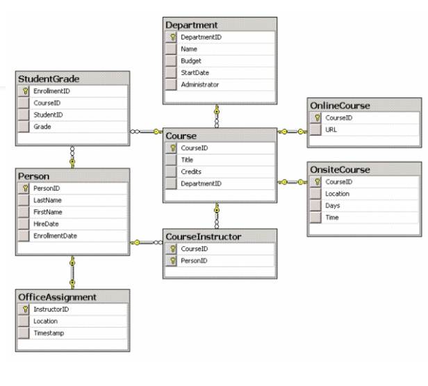
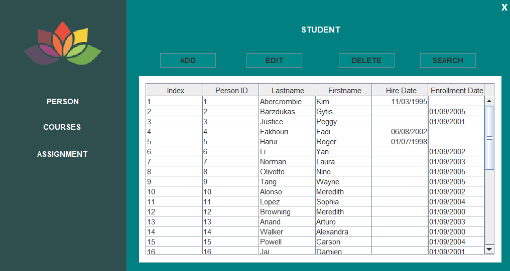
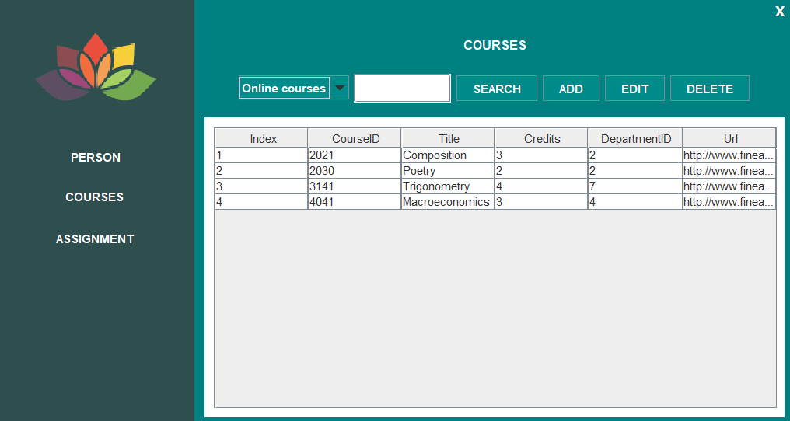
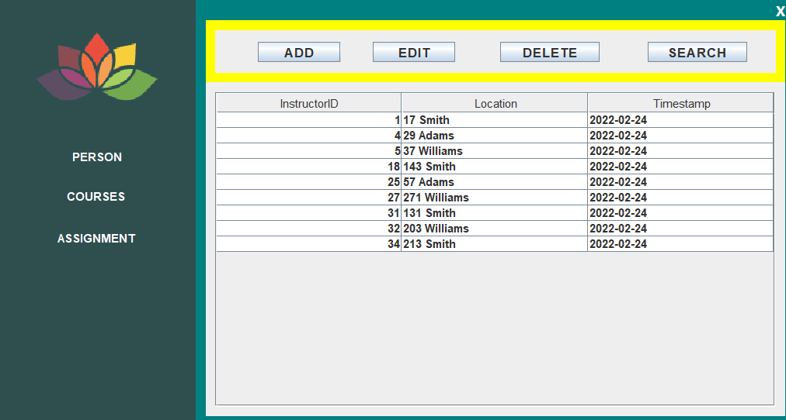

# Project

-   Bảng thiết kế các lớp:
    [Link bảng thiết kế class](https://drive.google.com/file/d/11JSxrB7UKw69p-p2fQTfUwzM5ABYs5nx/view?usp=share_link)
    

-   Các chức năng hiện có:

1. Thêm sửa xoá student
2. Thêm sửa xoá onlinecourse, onsitecourse
3. Thêm sửa xoá assignment

-   Một số hình ảnh:
    
    
    
